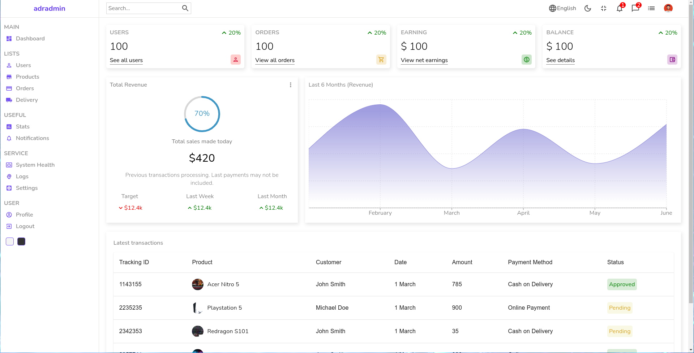
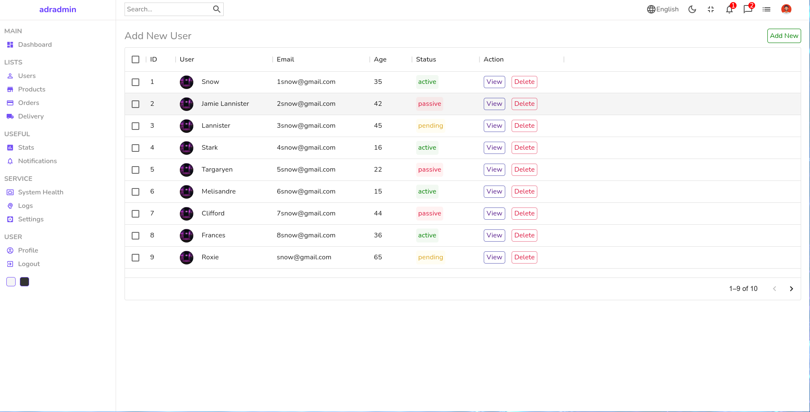
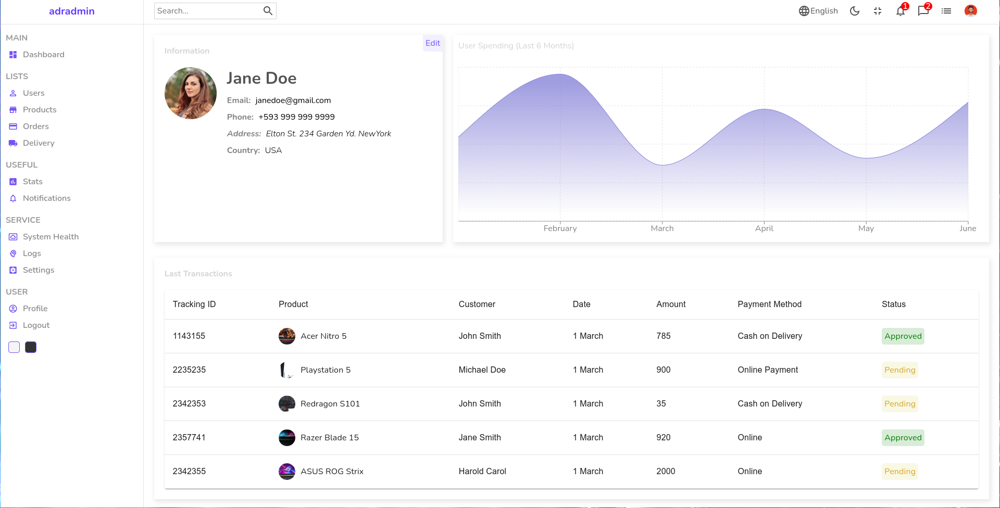
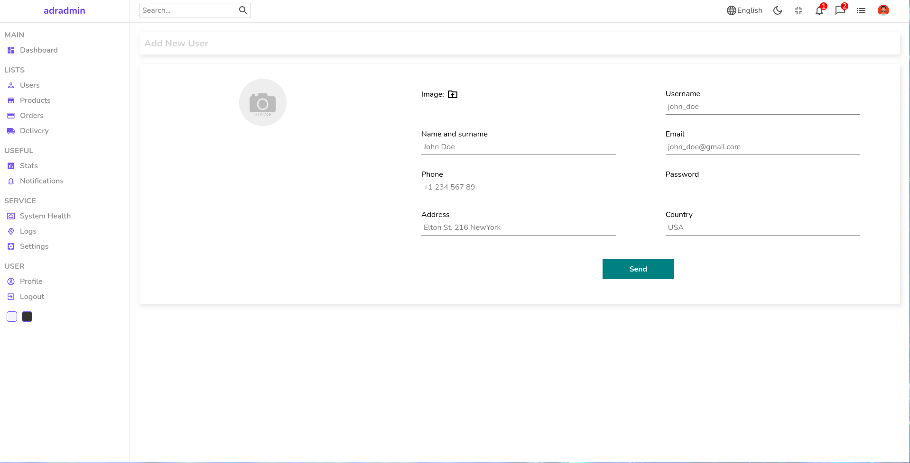
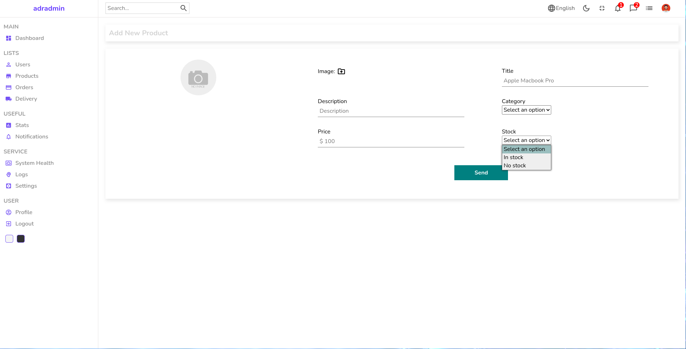

# Basic Admin Panel

## Running the app

```
# install dependencies with yarn:
yarn install

# or npm:
npm i


# run in dev mode on port 3000:
yarn dev

# or:
npm run dev


# generate production build:
yarn build

# or:
npm run dev
```

## View demo

[Demo](https://react-admin-panel-bld.netlify.app/)

​

## Screenshots






